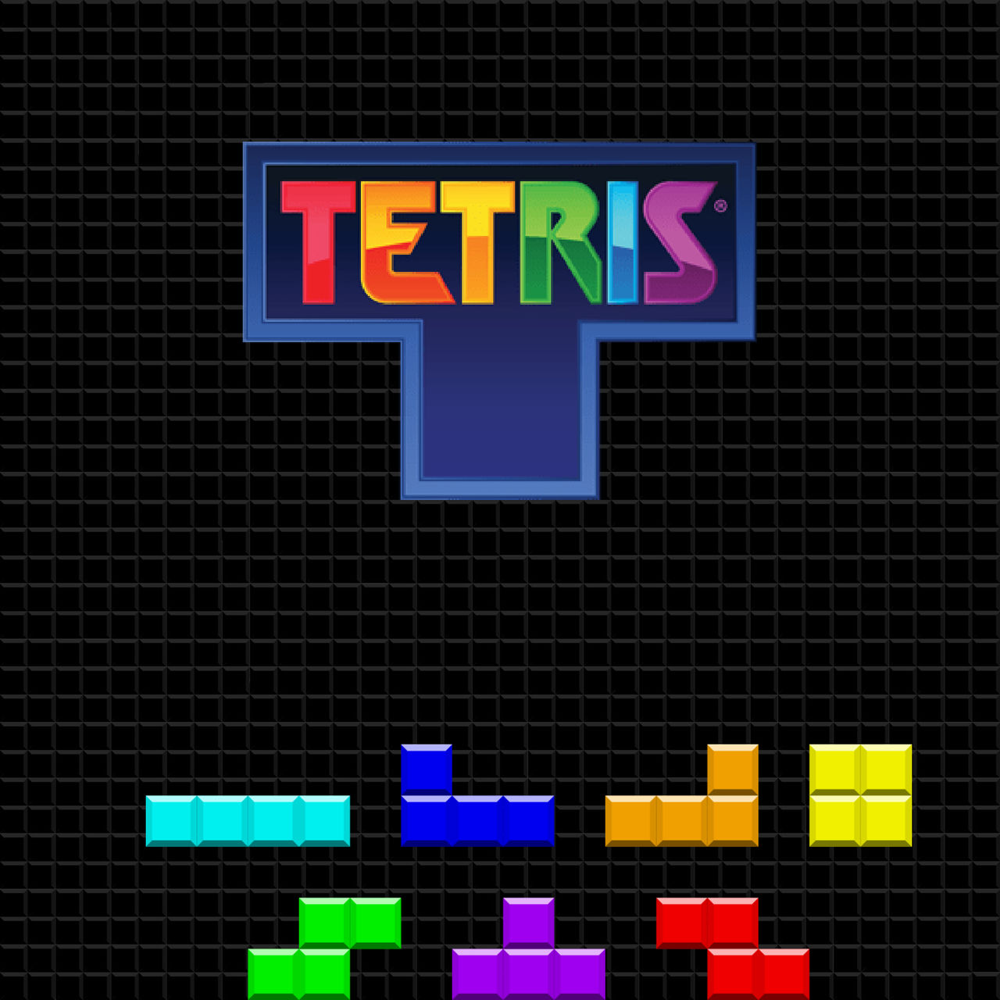

# Tetris Game

A classic Tetris game implemented in Python using the Pygame library. This game features traditional Tetris gameplay with a graphical interface, including a welcome screen, game over screen, and touch controls.

## Features

- Classic Tetris gameplay with seven types of pieces.
- Adjustable game speed based on level.
- Welcome screen with username input.
- Game over screen with the option to restart.
- Touch controls for mobile devices.
- Simple and intuitive user interface.

## Requirements

- Python 3.x
- Pygame library

## Installation

1. **Clone the repository:**
   `git clone https://github.com/arad1367/tetris_game_huggingface.git`

2. **Navigate to the project directory:**
    `cd tetris_game_huggingface`

3. **Install the required Python packages:**
    `pip install -r requirements.txt`

4. **Download background image**
- The game requires a background image named tetris7.png to be placed in an images directory. Ensure the image file is present at `images/tetris7.png`.

5. **Run the game**
    `python app.py`

## Controls
- Arrow Keys: Move the Tetris piece left, right, or down.
- Up Arrow: Rotate the Tetris piece.
- Spacebar: Drop the Tetris piece to the bottom.
- Touch Controls: On touch devices, tap the left or right side of the screen to move the piece, and tap the bottom to move it down. Tap the top to rotate.

## Gameplay
- Objective: Rotate and move the falling Tetris pieces to create complete lines across the grid. Complete lines are cleared, and you score points.
- Game Over: The game ends when new pieces cannot be placed on the grid.

## Contributing
- If you want to contribute to this project, please fork the repository and submit a pull request. For major changes, please open an issue first to discuss what you would like to change.

## License
- This project is licensed under the MIT License

## Acknowledgements
- The Pygame library for creating the game interface and handling user input.
- The classic Tetris game concept and design.
- Thanks to Hugging face foe easy 5 stars deploy
- The Tetris Theme A music is based on an old Russian folk song called "Korobeiniki" and was adapted for the classic game Tetris by Hirokazu Tanaka.

## Contact
* For any questions or feedback, please contact pejman.ebrahimi77@gmail.com

Happy gaming!